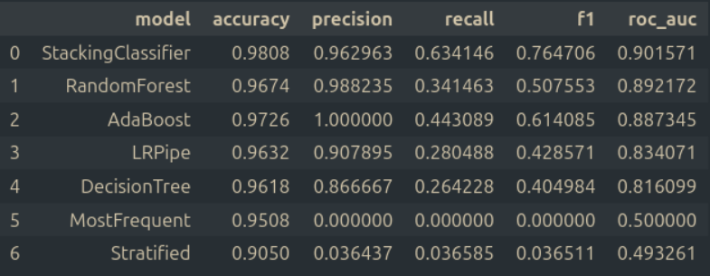
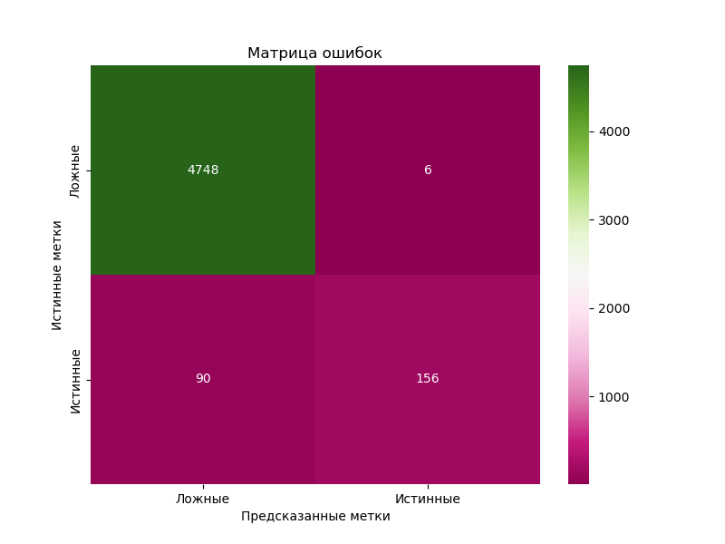
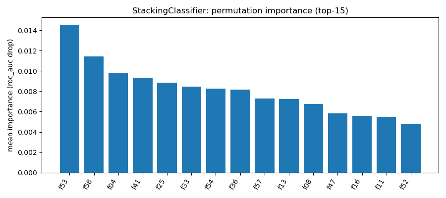

# HW06 – Report

> Файл: `homeworks/HW06/report.md`  
> Важно: не меняйте названия разделов (заголовков). Заполняйте текстом и/или вставляйте результаты.

## 1. Dataset

- Какой датасет выбран: `S06-hw-dataset-04.csv`
- Размер: (25000, 62)
- Целевая переменная: `target` (0 - `0.9508`; 1 - `0.0492`)
- Признаки: числовые

## 2. Protocol

- Разбиение: train/test (`0.8`/`0.2`, `random_state=42`)
- Подбор: CV на train (`5` фолдов, оптимизировалась `ROC-AUC`)
- Метрики: accuracy, F1, ROC-AUC

    `Accuracy` нельзя считать информативной метрикой в контексте задач с сильным дисбалансом классов, в отличие от `F1` и `ROC-AUC,` которые позволяют оценивать модели при дисбалансе.
    Самой трудной для максимизации метрикой стала `Recall`.

## 3. Models

В ходе работы сравнивались следующие модели с подбором соответствующих гиперпараметров:

Бейзлан модели:
- DummyClassifier (`stratified` и `most frequent`)
- LogisticRegression

Модели недели 6:

- DecisionTreeClassifier (`max_depth`, `min_samples_leaf`, `min_samples_split`, `criterion`)
- RandomForestClassifier (`max_depth`, `n_estimators`)
- AdaBoostClassifier (`max_depth`, `learning_rate`, `n_estimators`)
- StackingClassifier (DecisionTreeClassifier + RandomForestClassifier + AdaBoost -> LogisticRegression) (с CV-логикой)

## 4. Results

Таблица финальных метрик на test по всем моделям

Победитель по ROC-AUC - стакинг на основе решающего дерева, случайного леса и адаптивного бустинга в качестве базовых моделей и логистической регрессии в качестве мета-модели, который превосходит все прочие модели и по F1. Модель можно считать самой сложной из всех разработанных.

## 5. Analysis

- Устойчивость: при изменении `random_state` стэкинг-модель иногда уступает случайному лесу или адаптивному бустингу на ~1% по ROC-AUC, но при этом сохраняет лидерство по F1 с явным преимуществом  

- Ошибки: confusion matrix для лучшей модели

Модель практически не совершает ошибок в мажоритарном классе, точность среди миноритарного составляет порядкка 64% 

- Интерпретация: permutation importance (top-15)

Наиболее влиятельными оказались признаки под номерами 53, 58, 4, 41 и 25. Значения важности всех признаков близки к 0, что может быть связано с масштабом самих данных.

## 6. Conclusion

Деревья решений легко интерпретируемы, не требуют масштабирования данных, но склонны к переобучению и неустойчивы к шуму. Случайные леса менее склонны переобучение и обладают большей устойчивостью, так как каждое дерево в ансамбле обучается на слуйчаном подмножестве признаков. При бустинге деревья строятся последовательно и компенсируют ошибки друг друга. При стэкинге  нескольких разных моделей независимо вычисляют признаки для мета-модели, которая делает итоговый прогноз.
Ансамблевые модели показали себя наиболее эффективными для решения поставленной задачи.  

Честный ML-протокол подразумевает под собой фиксацию всех результатов экспериментов и наблюдений, так, как оно есть на самом деле, честную оценку обобщающей способности, воспроизводимость и прозрачность результатов работы.
