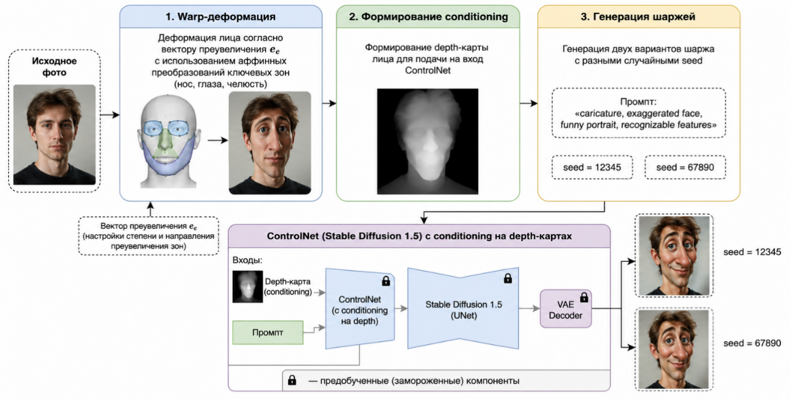

# Отчёт по итоговому проекту по курсу «Инженерия Искусственного Интеллекта»

> Рекомендуемый объём отчёта: 3-5 страниц в эквиваленте Markdown/печатного текста.  
> Отчёт должен позволить преподавателю понять задачу, данные, выбранные модели и результаты экспериментов.

---

## 1. Паспорт проекта

- **Название проекта:** `Сервис генерации шаржей`
- **Авторы:** `Хармац Ян Ильич`, `Рудаков Кирилл Анреивич`
- **Группа:** `БСБО-51-24`
- **Контакт:** `@harulla34`, `@Ki_RiII`
- **Ссылка на репозиторий:** `https://github.com/iankharmats/MireaAIE/`

- **Краткое описание (2-4 предложения):**  
`Проект посвящён созданию онлайн-сервиса автоматической художественной стилизации портретов в карикатуру. В основе решения — детекция лица с помощью MediaPipe, управляемая деформация на основе ключевых точек, дообученный ControlNet для генерации шаржей и RLAIF-критик на базе VLLM для оценки качества и выбора лучшего варианта. Итоговый продукт — веб-интерфейс FastAPI, позволяющий загрузить фото и получить карикатуру с сохранением узнаваемости черт.`

---

## 2. Постановка задачи и контекст

1. **Предметная область и задача:**
   - Задача относится к области компьютерного зрения и генеративного ИИ, а именно — художественной стилизации портретов с элементами гротеска.
   - Пользователь сервиса — любой человек, желающий получить шуточное, но узнаваемое изображение себя или другого человека. Сценарий использования: загрузка фото → автоматическая генерация → получение карикатуры.

2. **Формулировка задачи в терминах ML/ИИ:**
   - Входные данные: цветное изображение (портрет) в форматах JPEG/PNG.
   - Выход модели: изображение-карикатура того же человека с преувеличенными характерными чертами (нос, подбородок, глаза, лоб), выполненное в едином художественном стиле.
   - Ограничения: время генерации ≤ 10 секунд (на GPU T4), сохранение идентичности личности.

3. **Целевые метрики качества:**
   - **Cosine similarity (FaceNet)** между эмбеддингами оригинала и шаржа.
   - **Доля артефактов** для сгенерированных изображений
   - Полный список в configs/metrics.yaml

---

## 3.Данные

1. **Источник данных:**
   - **Для детекции и параметризации:** открытый датасет Humans (> 3000 лиц анфас). Ссылка: https://www.kaggle.com/datasets/ashwingupta3012/human-faces/data
   - **Для дообучения ControlNet:** синтетический датасет из ~300 наборов "оригинал - шарж", сгенерированных с помощью предобученной модели ( ControlNet + Qwen-критик без дообучения).

2. **Структура данных:**
   - Обработка **изображений и векторов**.
   - Подробное описание: `data/data_description` и `README.md` 

3. **Предобработка и EDA:**
   - **Предобработка:** удаление дубликатов, приведение всех изображений к 512×512, расчёт ключевых расстояний (лоб, нос, глаза, челюсть и тд), извлечение Canny-границ.
   - **Анализ и извлечение признаков (`notebooks/feature_extraction.ipynb`):**
     - Рассчитаны средние расстояние и углы черт лица, визуализированы в `artifacts/visualisation/mean_face.png`
     - Артефакты генерации (размытие, смещение глаз) встречаются в ~25% сырых сгенерированных изображениях, что обосновывает необходимость RLAIF-фильтра.

---

## 4. Модели и подходы

Опишите, какие модели вы пробовали и как развивался ваш подход:

1. **Базовые (baseline) модели:**
   - **Детекция:** MediaPipe Face Mesh (478 точек) — предобученная модель для разметки ключевых точек на лицах (`notebooks/feature_extraction.ipynb`)
   - **Генерация:** Стандартный ControlNet (`lllyasviel/sd-controlnet-canny`) + SD 1.5 без дообучения.
   - **Критик:** Qwen2-VL

2. **Улучшенные модели и эксперименты: (`notebooks/dpo_train.ipynb`)**
   - **ControlNet + LoRA:** дообучение на ~300 парах «Canny → шарж»  
   - **RLAIF пайплайн:** генерация 3 вариантов на запрос → оценка каждого через Qwen → выбор. Пользователь получает лучший вариант.

3. **Нейросетевые модели (если применимо):**
   - **MediaPipe** (быстрая CNN разметки точек)
   - **ControlNet** (архитектура: копия UNet Stable Diffusion с zero-conv слоями).
   - **Qwen-2VL** (LLM + Vision Encoder)

---

## 5. Экспериментальный протокол и результаты

1. **Экспериментальный протокол:**
   - Выборка: ~300 пар (оригинал → шарж). Разделение: train 70%, val 15%, test 15%.
   - Метрики считались на тестовой выборке.

2. **Сравнение моделей по метрикам:**

| Модель / конфигурация | Описание | Cosine similarity ↑ |  Артефакты (частота) ↓ |
|-----------------------|----------|---------------------|------------------------|
| Baseline (без дообучения) | ControlNet + rule-based выбор | 0.66 |  30% |
| ControlNet LoRA + Qwen | Дообученный ControlNet  | 0.58 |  14% |

3. **Выбор финальной модели:**
   - Финальная конфигурация: **ControlNet LoRA + Qwen**.
   - Обоснование: лучший баланс между сохранением идентичности и минимальный процент артефактов.

---

## 6. Архитектура решения и сервис

Опишите, как из модели получился работающий сервис:

1. **Архитектура пайплайна:**
   
   

2. **API и endpoints:**
   - `GET /health` - health-check сервиса.
   - `GET /metrics` - статистика по работе сервиса: общее количество реквест-запросов, среднее время выполнения запросов

   - `POST /generate` - принимает изображение, возвращает лучший шарж.
   - `POST /warp` - тестовый эндпоинт для проверки деформации.

3. **Технологический стек:**
   - Python 3.11, PyTorch 2.0+, Diffusers, Transformers, PEFT (LoRA), MediaPipe, OpenCV.
   - Веб-фреймворк: FastAPI + Uvicorn.
   - Запуск: `uv run uvicorn src.api:app --reload --port 8000`.

---

## 7. Наблюдаемость, конфигурация и безопасность

1. **Логи и наблюдаемость:**
- Логируются: время обработки запроса, количество сгенерированных вариантов, метрики генерации.
- Метрики (`/metrics`): общее число запросов, среднее время генерации, метрики генерации.

2. **Безопасность:**
- Секреты не закоммичены, используются переменные окружения.
- Большие файлы моделей не хранятся в репозитории (добавлены в `.gitignore`, загружаются удаленно).

---

## 8. Ограничения и дальнейшая работа

**Ограничения:**
- Требуется GPU (20+GB VRAM) для инференса (ControlNet + Qwen одновременно).
- Дообучение проводилось на синтетическом датасете (~300 пар), что может ограничить обобщающую способность.
- RLAIF-критик оценивает только 3 параметра; более тонкие аспекты карикатуры (культурные, жанровые) не учитываются.
- Веб-интерфейс поддерживает только одиночные запросы (нет очереди или асинхронной обработки большого потока).

**Дальнейшая работа:**
- Увеличение датасета до 5000+ пар с ручной разметкой (краудсорсинг).
- Экспорт модели в ONNX/TensorRT для ускорения инференса.
- Многопользовательская очередь задач (Celery + Redis).
- Развёртывание на бесплатных GPU-серверах (Hugging Face Spaces, Colab).

---

## 9. Сценарий демонстрации на защите

1. **Запуск:**
- Перехожу в папку `project/`, активирую окружение, выполняю `uv run uvicorn src.api:app --reload --port 8000`.
- Сервис поднимается на `http://127.0.0.1:8000`.

2. **Ключевые сценарии:**
- **Сценарий 1:** загружаю произвольное фото человека из директории `data/demo/Humans/` на эндпоинт `/generate` → сервис генерирует 3 варианта → Qwen выбирает лучший → показываю результат. Комментирую, на каких отличительных чертах человека алгоритм сконцентрировал внимание. Затем загружу тоже изображение на эндпоинт `/warp`, показываю деформацию лица до подачи на генеративную модель. 
- **Сценарий 2:** демонстрация метрик: отправляю запрос на `/metrics`, показываю долю артефактов и схожесть последнего вызова `/generate`

3. **На что обратить внимание преподавателя:**
- Качество итоговой карикатуры (узнаваемость лица) и отличие от обычной деформации.
- Прикачества после дообучения ControlNet и Qwen - кратко покажу `dpo_train.ipynb`.
- Архитектура: все этапы (детекция → warp → ControlNet → Qwen-критик) связаны в единый пайплайн, выборочно покажу визуализацию `artifacts/`.
- Полная воспроизводимость: проект запускается по `README.md`, все модели загружаются скриптами, секреты не закоммичены.

**Команды для демонстрации (из `README.md`):**
```bash
cd project
uv venv --python 3.11
source .venv/bin/activate
uv sync
uv run uvicorn src.api:app --reload --port 8000
```

Далее через браузер открыть http://127.0.0.1:8000 или использовать curl (пример в README.md).

---
